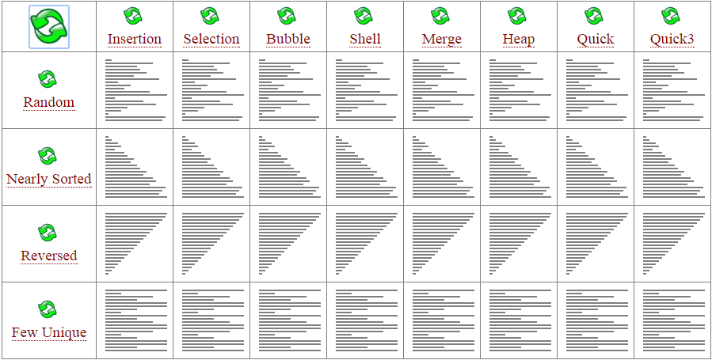
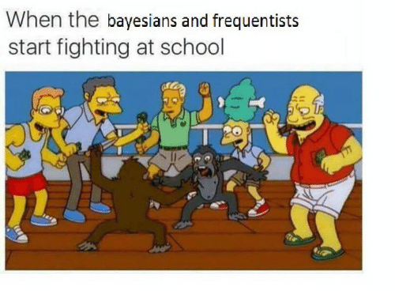

```{r Lec1, echo=FALSE, warning=FALSE, message=FALSE, cache=FALSE}
#source("../assets/lec_first_chunk.R")

suppressPackageStartupMessages(library(tidyverse))
suppressPackageStartupMessages(library(ggplot2))
suppressPackageStartupMessages(library(here))
suppressPackageStartupMessages(library(rmarkdown))
suppressPackageStartupMessages(library(knitr))
suppressPackageStartupMessages(library(prevalence))
suppressPackageStartupMessages(library(plotly))
 
set.seed(1)
```

$$
\require{color}
\definecolor{prior}{RGB}{248,118,109}
\definecolor{like}{RGB}{0,186,56}
\definecolor{post}{RGB}{97,156,255}
\definecolor{margin}{RGB}{199,124,255}
$$
 

### Outline
  
* Advantages of R markdown.

* Animations and gifs.

* Custom colours and latex macros.

* mathjax.

* Opportunities.
  
* Parting thoughts 
  
---

class: segue


.white[

# R markdown

]

---

### R markdown

R Markdown documents provide an interface for weaving together 
narrative text and code to produce elegantly formatted output
using multiple languages including R, Python, and SQL.

The key advantages are

* Documents are fully reproducible.

* Code and text are integrated into the same document.

* Knitting documents to HTML allows us to leverage functionality
of web browsers to create engaging and interactive content.

  * Animations, gifs and memes.
  
  * Interactive elements: Javascript, shiny apps, and D3.
  
  * Embedding content: YouTube, pdfs, flash and other media.


---

class: segue


.white[

# Animations and gifs

]

---

### Animations

* Animations can be an engaging way of depicting a process
in a way that would take longer if described formally as an
algorithm or pseudo-code.

* There are a number of packages that allow producing animations.
The main packages are:

  * `gganimate`
  
  * `animation` 
  
  * `plotly`
  
* For each of these there is a trade-off between "easy and inflexbile"
against "hard and inflexible".

---

### gganimate package


.pull-left[

```{r, eval=TRUE, echo=TRUE}
nmax <- 30
mu <- 0
sigma <- 5
xg <- seq(-5,5,,100)
dat <- c()
for (n in 1:nmax) 
{
  yg      <- dnorm(xg,mu,sigma/sqrt(n))
  dat_bit <- cbind(xg,yg,n)
  dat     <- rbind(dat,dat_bit)
}
colnames(dat) <- c("x","y","n_val")
tib <- as_tibble(dat)

library(gganimate)
g <- ggplot(tib,aes(x=x,y=y)) +
  geom_line(size=1.5) +
  theme_bw(base_size = 22) + 
  coord_cartesian(xlim = c(-5,5)) +
  labs(x='X bar',y='density', title = "n: { round(frame_time) }")  +
  transition_time(time=n_val) 
```
]

.pull-right[
 
```{r, eval=TRUE, echo=FALSE, fig.width=5, fig.height=6}
g
```
]


---

### animation package 

.small[
```{r, echo=TRUE, eval=FALSE}
library(animation)
val <- saveGIF({
    for (i in 1:nFrames) {
      # Plot some stuff here
      
      ani.pause()  
    }
  }, 
  movie.name="someFile.gif", 
  img.name = "Rplot", 
  convert = "magick", 
  cmd.fun, 
  clean = TRUE, 
  extra.opts = "",
  interval = 0.1, 
  nmax = 100, 
  ani.width=1200, 
  ani.height=600, 
  autobrowse=FALSE,
  verbose=FALSE)
```
]

---

### plotly package

.pull-left[
```{r,echo=TRUE, eval=TRUE}
library(plotly)
library(gapminder)

p <- gapminder %>%
  plot_ly(
    x = ~gdpPercap, 
    y = ~lifeExp, 
    size = ~pop, 
    color = ~continent, 
    frame = ~year, 
    text = ~country, 
    hoverinfo = "text",
    type = 'scatter',
    mode = 'markers'
  ) %>%
  layout(
    xaxis = list(
      type = "log"
    )
  )
```
]


.pull-right[
```{r,echo=FALSE, eval=TRUE, warning=FALSE}
p
```


Lots of examples can be found at: https://plot.ly/r/
]

---

class: segue


.white[

# Examples

]

---


# Sorting algorithms

There are numerous sorting algorithms

<center>

</center>

The "speed" of classification trees depends on how quickly one can sort.

The speed of most sorting algorithms needs $O( n \log(n) )$ steps
to sort $n$ values. 

---

# External link

<!--
<iframe width="560" height="315" src="https://www.youtube.com/watch?v=ywWBy6J5gz8" frameborder="0" allowfullscreen></iframe>
-->


 
[For fun....](https://www.youtube.com/watch?v=ywWBy6J5gz8)
 
---

```{r, fig.retina=4, echo=FALSE}
library(here)
file_path <- here("data","Exam.csv")
data <- read.csv(file_path, header=T)
#head(data,4)
```

```{r, echo=FALSE}
y  <- data$Label
x1 <- data$Exam1
x2 <- data$Exam2
n  <- length(y)
```

```{r, echo=FALSE}
x1_unqiue <- unique(sort(x1))
n1_unique <- length(x1_unqiue)

splits1 <- c()
predict_left <- c()
predict_right <- c()
missclass1 <- c()

mE1 <- matrix(NA,n1_unique,n)

for (j in 1:(n1_unique-1))
{
  splits1[j] <- mean(x1_unqiue[j:(j+1)])
  
  inds_left  <- which(x1<splits1[j])
  inds_right <- which(x1>splits1[j])
  
  y_left  <- y[inds_left]
  y_right <- y[inds_right]
  predict_left[j]  <- median(y_left)
  predict_right[j] <- median(y_right)

  y_left_hat  <- rep(predict_left[j], length(y_left))
  y_right_hat <- rep(predict_right[j],length(y_right))
  
  y_hat <- rep(NA,n)
  y_hat[inds_left] <- y_left_hat
  y_hat[inds_right] <- y_right_hat
  
  mE1[j,] <- (y!=y_hat)
  missclass1[j] <- sum(mE1[j,])
}
```

```{r, echo=FALSE}
x2_unqiue <- unique(sort(x2))
n2_unique <- length(x2_unqiue)

splits2 <- c()
predict_top <- c()
predict_bot <- c()
missclass2 <- c()

mE2 <- matrix(NA,n2_unique,n)

for (j in 1:(n2_unique-1))
{
  splits2[j] <- mean(x2_unqiue[j:(j+1)])
  
  inds_top <- which(x2>splits2[j])
  inds_bot <- which(x2<splits2[j])
  
  y_top  <- y[inds_top]
  y_bot <- y[inds_bot]
  predict_top[j] <- median(y_top)
  predict_bot[j] <- median(y_bot)

  y_top_hat <- rep(predict_top[j], length(y_top))
  y_bot_hat <- rep(predict_bot[j], length(y_bot))
  
  y_hat <- rep(NA,n)
  y_hat[inds_top] <- y_top_hat
  y_hat[inds_bot] <- y_bot_hat
  
  mE2[j,] <- (y!=y_hat)
  missclass2[j] <- sum(mE2[j,])
}
```

```{r, echo=FALSE, eval=FALSE}
library(animation)
library(jcolors)
palette <- jcolors('default')

val <- saveGIF(
  {
 
    for (i in 1:(n1_unique-1)) {
      par(mfrow=c(1,2))
      
      xlim_val <- range(x1)
      ylim_val <- range(x2)
    
      plot(NA,type="n",xlim=xlim_val,ylim=ylim_val,xlab="Exam1",ylab="Exam2",cex.lab=1.5,main="Exams vs Failures",cex.main=2)
      
      alpha <- 0.35
      col0 <- rgb(1, 0, 0,alpha)
      col1 <- rgb(0, 0, 1,alpha)
      col_left  <- ifelse(predict_left[i]==1, col1,col0)
      col_right <- ifelse(predict_right[i]==1,col1,col0)
      
      polygon(c(-100, splits1[i], splits1[i], -100), c(-100, -100, 200,200),  col=col_left, border=NA)
      polygon(c( 200, splits1[i], splits1[i],  200), c(-100, -100, 200,200),  col=col_right, border=NA)
      
      points(x1[y==0],x2[y==0],col="red",pch=16,cex=3)
      points(x1[y==1],x2[y==1],col="blue",pch=16,cex=3)
      points(x1[mE1[i,]],x2[mE1[i,]],pch=4,lwd=3,cex=3)
      
      plot(NA,type="n",xlim=range(c(x1,x2)),ylim=range(c(missclass1,missclass2)),xlab="Exam Mark",ylab="missclassifications",cex.lab=1.5,main="Missclassifications per split",cex.main=2)
      lines(splits1[1:i],missclass1[1:i],lwd=4,col="purple")
       
      ani.pause()  
    }
  }, 
  movie.name="two_d_cart.gif", img.name = "Rplot", convert = "magick", 
  cmd.fun, clean = TRUE, extra.opts = "",
  interval = 0.1, 
                nmax = 100, 
                ani.width=1200, 
                ani.height=600, 
                autobrowse=FALSE,
                verbose=FALSE)

```
### Calculate the number of misclassifications along all splits for Exam1 classifying according to the majority class for the left and right splits
 
<center>

</center>

Red dots are "fails", blue dots are "passes", and crosses indicate misclassifications.

---


 

```{r, echo=FALSE, eval=FALSE}
library(animation)
library(jcolors)
palette <- jcolors('default')

val <- saveGIF(
  {
 
    for (i in 1:(n2_unique-1)) {
      par(mfrow=c(1,2))
      
      xlim_val <- range(x1)
      ylim_val <- range(x2)
    
      plot(NA,type="n",xlim=xlim_val,ylim=ylim_val,xlab="Exam1",ylab="Exam2",cex.lab=1.5,main="Exams vs Failures",cex.main=2)
      
      alpha <- 0.35
      col0 <- rgb(1, 0, 0,alpha)
      col1 <- rgb(0, 0, 1,alpha)
      col_top <- ifelse(predict_top[i]==1, col1,col0)
      col_bot <- ifelse(predict_bot[i]==1,col1,col0)
      
      polygon(c(-100, -100, 200,200), c(-100, splits2[i], splits2[i], -100), col=col_bot, border=NA)
      polygon(c(-100, -100, 200,200), c( 200, splits2[i], splits2[i],  200), col=col_top, border=NA)
      
      points(x1[y==0],x2[y==0],col="red",pch=16,cex=3)
      points(x1[y==1],x2[y==1],col="blue",pch=16,cex=3)
      points(x1[mE2[i,]],x2[mE2[i,]],pch=4,lwd=3,cex=3)
      
      plot(NA,type="n",xlim=range(c(x1,x2)),ylim=range(c(missclass1,missclass2)),xlab="Exam Mark",ylab="missclassifications",cex.lab=1.5,main="Missclassifications per split",cex.main=2)
      lines(splits1,     missclass1,lwd=4,col="purple")
      lines(splits2[1:i],missclass2[1:i],lwd=4,col="orange")
      
      ani.pause()  
    }
  }, 
  movie.name="two_d_cart2.gif", img.name = "Rplot", convert = "magick", 
  cmd.fun, clean = TRUE, extra.opts = "",
  interval = 0.1, 
                nmax = 100, 
                ani.width=1200, 
                ani.height=600, 
                autobrowse=FALSE,
                verbose=FALSE)
```

### Calculate the number of misclassifications along all splits for Exam2 classifying acording to the majority class for the top and bottom splits

<center>

</center>

Red dots are "fails", blue dots are "passes", and crosses indicate misclassifications.

---
 
.pull-left-2[

### Using animations to illustrate concepts

In frequentist inference estimators of parameters functions of random
draws from a particular distribution, e.g.,
\begin{align}
\widehat{\mu} = f(X_1,\ldots,X_n) = \overline{X}
\end{align}

where, say,
\begin{align}
X_i \stackrel{iid}{\sim} N(\mu,\sigma^2), \qquad i=1,\ldots,n
\end{align}

(with $\sigma^2$ known) and
$f(X_1,\ldots,X_n) = \frac{1}{n}\sum_{i=1}^n X_i$.

Properties of the estimator are determined by how $f(X_1,\ldots,X_n)$
behaves in expectation/variance, or as $n$ becomes large.
]

.pull-right-1[

<br>

<br>

```{r, eval=TRUE, echo=FALSE, fig.width=5, fig.height=6}
nmax <- 30
mu <- 0
sigma <- 5
xg <- seq(-5,5,,100)
dat <- c()
for (n in 1:nmax) 
{
  yg      <- dnorm(xg,mu,sigma/sqrt(n))
  dat_bit <- cbind(xg,yg,n)
  dat     <- rbind(dat,dat_bit)
}
colnames(dat) <- c("x","y","n_val")
tib <- as_tibble(dat)

library(gganimate)
g <- ggplot(tib,aes(x=x,y=y)) +
  geom_line(size=1.5) +
  theme_bw(base_size = 22) + 
  coord_cartesian(xlim = c(-5,5)) +
  labs(x='X bar',y='density', title = "n: { round(frame_time) }")  +
  transition_time(time=n_val) 
g
```
]

---


 
### Bayesians and Frequentists fighting

And of course the main advantage of working with HTML is the memes and gifs.
   
<center>



</center>

* While some might think that memes are a distraction I think this is a mistake.

* People learn better when they feel psychologically safe. 

* Humour can "tell" the nervous system that students are safe.

> Stephen W Porges (2009). 
> The polyvagal theory: New insights into adaptive reactions of the autonomic nervous system. 
> Cleveland Clinic Journal of Medicine.

---


class: segue


.white[

# Custom colours and latex macros

]


 
---


 
.pull-left-2[

### The rationale of Bayesian inference

Bayesian inference takes in one further step. Since $\widehat{\mu}$
is random why not treat $\mu$ as random?

The model is then treated as a conditional probability or conditional
statement about the data (the $X_i$'s) conditional on the parameter(s), e.g., $\mu$.

We can then state a distribution for $\color{prior}{p(\mu)}$ called the .prior[prior distribution].

We Bayes theorem
to derive the distribution of $\mu$ conditional on the observed sample
$x_1,\ldots,x_n$, i.e., ${\color{post} p(\mu|{\bf x})}$ called the .post[posterior distribution]
\begin{align}
\displaystyle {\color{post} p(\mu|{\bf x})} = \frac{\left[ 
{\color{like} \prod_{i=1}^n p(x_i|\mu)} \right]{\color{prior} p(\mu)}}{\int_{-\infty}^\infty \left[ \color{like}{\prod_{i=1}^n p(x_i|\mu)} \right]{\color{prior} p(\mu)} d\mu}
\end{align}

(I will explain the above in more detail later).
]

.pull-right-1[

<br>

<br>

```{r, eval=TRUE, echo=FALSE, fig.width=5, fig.height=6}
nmax <- 20
mu <- 0
sigma <- 5

xg <- seq(-5,15,,100)
x <- rnorm(nmax,mu,sigma)

x_bar <- mean(x)
se    <- sigma/sqrt(n)
se2   <- se^2

a <- 5
b2 <- 3
b <- sqrt(b2)

w <- (1/se2)/(1/se2 + 1/b2)

post_mean <- w*x_bar + (1 - w)*a
post_var  <- 1/(1/se2 + 1/b2)
post_se   <- sqrt(post_var)

f_prior <- dnorm(xg,a,b)
f_like  <- dnorm(xg,x_bar,se)
f_post  <- dnorm(xg,post_mean,post_se)

dat1 <- cbind(xg,f_prior,1)
dat2 <- cbind(xg,f_like,2)
dat3 <- cbind(xg,f_post,3)
dat <- rbind(dat1,dat2,dat3)

colnames(dat) <- c("x","y","density")
df <- data.frame(dat)
df[,3] <- factor(df[,3],levels=c(1,2,3),labels=c("prior","likelihood","posterior"))

g <- ggplot(df,aes(x=x,y=y,color=density)) +
  geom_line(size=1.5) +
  theme_bw(base_size = 22) +
  theme(legend.position="bottom", legend.direction="vertical") +
  coord_cartesian(xlim = c(-3,10)) +
  labs(x='x',y='density', title = "Bayesian inference") 
g
```
]

---

### Custom colours and latex macros

.pull-left[

* Need to download color.js from mathjax website.

* In yaml header

```
includes:
  in_header: ["assets/mathjax-config.html"]
header-includes:
  - \usepackage{color}
```

* In main text specify colours in RGB codes (hexadecimal not supported):

```
$$
\require{color}
\definecolor{prior}{RGB}{248,118,109}
\definecolor{like}{RGB}{0,186,56}
\definecolor{post}{RGB}{97,156,255}
\definecolor{margin}{RGB}{199,124,255}
$$
```
]

.pull-right[


* in mathjax-config.html
```
<script type="text/x-mathjax-config">
MathJax.Hub.Config({
  TeX: { 
    extensions: ["color.js"],
    equationNumbers: { autoNumber: "AMS" } ,
    Macros: {
      bm: ["\\boldsymbol{#1}",1],
      y:    ["y_{\\text{#1},#2}",2],
      yhat: ["\\hat{y}_{\\text{#1},#2}",2],
      ytilde: ["\\tilde{y}_{\\text{#1},#2}",2],
      Shat: ["\\hat{S}_{\\text{#1},#2}^{(#3)}",3],
      vx: ["{\\bf x}"],
      ds: ["\\displaystyle"]
    }
  }
});
</script>
```
]


---

class: segue


.white[

# mathjax

]


---


### mathjax

 
* My biggest frustration has been typesetting equations.

* Complicated equations will often compile in latex, but mathjax will not render them properly.

* Some solutions:

  * Remove all unnecessary white spaces from equations, e.g.
```
$$P(B=b,C=c)=\sum_{k=1}^KP(B=b|A=a_k)P(C=c|A=a_k)P(A=a_k)=\sum_{k=1}^KP(A=a_k,B=b,C=c)$$
```
$$P(B=b,C=c)=\sum_{k=1}^KP(B=b|A=a_k)P(C=c|A=a_k)P(A=a_k)=\sum_{k=1}^KP(A=a_k,B=b,C=c)$$

```
$$
P(B=b,C=c) = \sum_{k=1}^K P(B=b|A=a_k) P(C=c|A=a_k)P(A=a_k) 
= \sum_{k=1}^KP(A=a_k,B=b,C=c)
$$
```
$$
P(B=b,C=c) = \sum_{k=1}^K P(B=b|A=a_k) P(C=c|A=a_k)P(A=a_k) 
= \sum_{k=1}^KP(A=a_k,B=b,C=c)
$$


---


### mathjax

* The align environment appears to be much more forgiving.

```
\begin{align}
{\color{post}\mu|\vx} 
\sim N\left( 
w{\color{like}\overline{x}} + (1 - w){\color{prior}a}, 
\left(\frac{1}{\color{like}\mbox{se}^2} + \frac{1}{\color{prior}b^2}\right)^{-1}  
\right)
\quad \mbox{where} \quad 
w = \frac{
  \ds\frac{1}{\color{like}\mbox{se}^2}
}{
  \ds\frac{1}{\color{like}\mbox{se}^2} + \frac{1}{\color{prior}b^2}
}
\end{align}
```

\begin{align}
{\color{post}\mu|\vx} 
\sim N\left( 
w{\color{like}\overline{x}} + (1 - w){\color{prior}a}, 
\left(\frac{1}{\color{like}\mbox{se}^2} + \frac{1}{\color{prior}b^2}\right)^{-1}  
\right)
\quad \mbox{where} \quad 
w = \frac{
  \ds\frac{1}{\color{like}\mbox{se}^2}
}{
  \ds\frac{1}{\color{like}\mbox{se}^2} + \frac{1}{\color{prior}b^2}
}
\end{align}


---

class: segue


.white[

# Opportunities

]


---

### A nice shiny app

<br>

<div style="text-align: center;"><iframe src="https://nanx.shinyapps.io/conjugate-normal-umkv/" frameborder="0" width="960" height="400"></iframe></div>

<br>

[Author Nan Xiao's website](https://stephens999.github.io/fiveMinuteStats/shiny_normal_example.html)

<br>


---

### In class exercise

Using the shiny app on the previous slide.

<br>

* When the prior mean is close to the data mean, what happens to the posterior distribution when

  * the prior standard deviation becomes small?
  
  * the prior standard deviation becomes large?

 
* What happens to the posterior distribution when 
when the prior mean is far away from the data mean and

  * the prior standard deviation becomes small?
  
  * the prior standard deviation becomes large?


 
---

### `learnr` package 


<center>

</center>

---


### D3.js

D3.js is a JavaScript library for producing dynamic, interactive data visualizations in web browsers.

```{r, echo=FALSE}
file_path <- here("data","data.Rda")
load(file_path)
suppressPackageStartupMessages({
  library(QUIC)
  library(networkD3)
  library(igraph)
})
nnzUpper <- function(C) {
    return( sum(C[lower.tri(C, diag = TRUE)] != 0) )
}
EBIC <- function(C,S,n,gamma)
{
    L <- n/2*(sum(log(eigen(C)$values)) - sum(diag(S%*%C)))
    E <- nnzUpper(C)
    p <- nrow(C)
    return( -2*L + E*log(n) + 4*E*gamma*log(p) )
}

EBIC_QUIC <- function(S, n, gamma = 0.75, rhoMin, rhoMax, rhoN, verbose=FALSE)
{
    if(verbose) print("The maximum sensible value of rho is:")
    if(verbose) print( max(max(S - diag(nrow(S))), -min(S - diag(nrow(S)))))
    vrho = exp(seq(log(rhoMin), log(rhoMax), length = rhoN))
    vEBIC <- rep(0,rhoN)
    for (i in 1:rhoN) {
        res <- QUIC(S, rho=vrho[i], msg=0, tol = 1.0E-12)
        vEBIC[i] <- EBIC(res$X,S,n,gamma)
    }
    ind <- which.min(vEBIC)
    res <- QUIC(S, rho=vrho[ind], msg=0)
    return(list(QUIC_result=res, rho=vrho, EBIC=vEBIC ))
}
```

.pull-left[
.small[
```{r, echo=TRUE, eval=FALSE}
library(QUIC)
library(networkD3)
library(igraph)
X <- na.omit(data)
S <- cor(X); n <- nrow(X)
res <- EBIC_QUIC(S, n, rhoMin = 0.1, rhoMax = 1, rhoN = 1000)

# Get adjacency matrix and put into igraph obj.
P <- res$QUIC_result$X
A <- ifelse(P!=0 & row(P)!=col(P),1,0)
g <- graph_from_adjacency_matrix(A, mode = "undirected", diag = FALSE)

# Use community detection to find densely connected nodes
wc <- cluster_walktrap(g)
members <- membership(wc)

# Use D3 to obtain an interactive plot of the network
g_d3 <- igraph_to_networkD3(g, group = members)
forceNetwork(Links = g_d3$links, Nodes = g_d3$nodes,
      Source = 'source', Target = 'target',
      NodeID = 'name', Group = 'group', linkDistance=200, charge=-10)
```
]
]

.pull-right[
```{r, echo=FALSE, eval=TRUE}
X <- na.omit(data)
S <- cor(X)
n <- nrow(X)
res <- EBIC_QUIC(S, n, rhoMin = 0.1, rhoMax = 1, rhoN = 1000)
## [1] "The maximum sensible value of rho is:"
## [1] 0.6749704
# Extract the estimated inverse correlation matrix
P <- res$QUIC_result$X

# Get the estimated adjacency matrix
A <- ifelse(P!=0 & row(P)!=col(P),1,0)

# Put the adjacency matrix into igraph fromat
g = graph_from_adjacency_matrix(A, mode = "undirected", diag = FALSE)

g <- g %>% set_vertex_attr("label", value = LETTERS[1:20])
  
# Use community detection to find densely connected nodes
wc <- cluster_walktrap(g)
members <- membership(wc)

# Convert to object suitable for networkD3
g_d3 <- igraph_to_networkD3(g, group = members)

# Use D3 to obtain an interactive plot of the network
forceNetwork(Links = g_d3$links, Nodes = g_d3$nodes,
      Source = 'source', Target = 'target',
      NodeID = 'name', Group = 'group', linkDistance=200, charge=-10)
```
]

---

class: segue


.white[

# Parting thoughts

]

---

### Should we be sharing teaching resources?

* To quote Dan Simpson (U. Toronto):

<center>

</center>

* There is too much multiple development of very similar
teaching resources in statistics groups across Australia.

* If we share resources, can we reduce everyone's teaching
load?

* DataCamp is an amazing teaching resource, but our reliance 
on their product in combination with mishandling of sexual
misconduct has lead to many of us making awkward decisions 
about using their products.

* Sharing teaching resources may be a solution to this problem.


---

class: segue


.white[

# Thank you for listening

]

 

